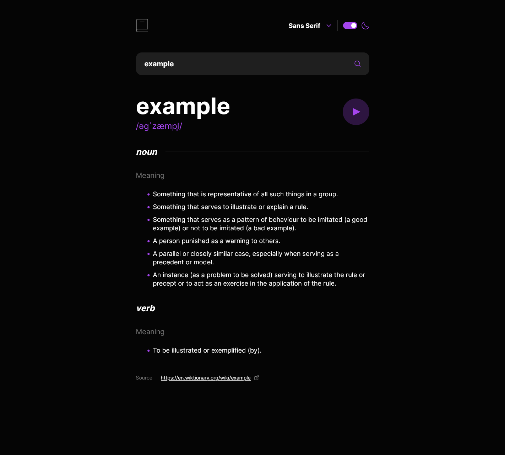

# Frontend Mentor - Dictionary web app solution

This is a solution to the [Dictionary web app challenge on Frontend Mentor](https://www.frontendmentor.io/challenges/dictionary-web-app-h5wwnyuKFL). Frontend Mentor challenges help you improve your coding skills by building realistic projects.

## The challenge

Users should be able to:

- Search for words using the input field
- See the Free Dictionary API's response for the searched word
- See a form validation messages
- Play the audio file for a word when it's available
- Switch between serif, sans serif, and monospace fonts
- Switch between light and dark themes (system default on first page load)
- View the optimal layout for the interface depending on their device's screen size
- Share or bookmark specific word searches with dynamic URL updates for a seamless experience in navigating search results

## Screenshot

## Links

- [Live Site URL](https://dictionary-web-app-mu-one.vercel.app/)

## Built with

- Mobile-first workflow
- TailwindCSS
- React
- Next.js
- Typescript
